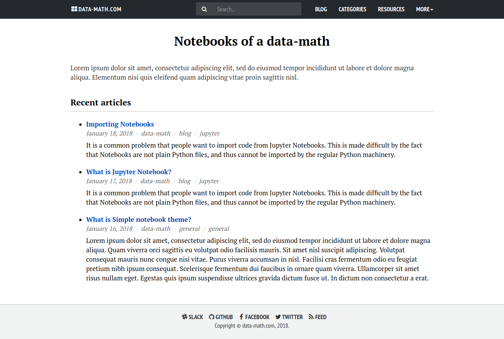
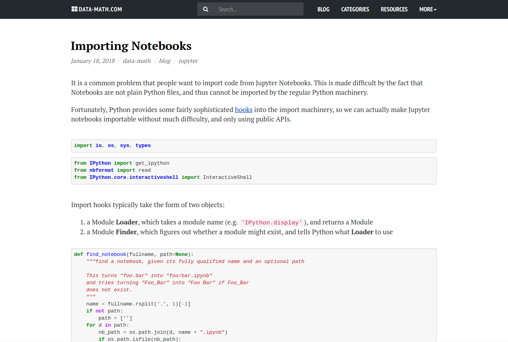

# Simple Notebook

Responsive theme for [Pelican](http://blog.getpelican.com/) Static Site Generator.

## Demo

I'm using Simple-Notebook in my [personal blog](http://data-math.com/).

### Screenshots





## Features

* Mobile First
* Responsive
* Syntax highlighting for code blocks
* RSS/ATOM feeds

## Integrations

* [Disqus](https://disqus.com/) 
* [Google Analytics](https://www.google.com/analytics/web/)

## Installation

You can install theme in your existing Pelican project or create a new Pelican project using a [Quickstart](http://docs.getpelican.com) guide.

* Clone the repository into your project 'themes' folder

```
$ git clone git@github.com:susumige/simple-notebook.git
```

* Create a `THEME` variable in your `pelicanconf.py` file and set its value to the location of simple-notebook theme.

```python
THEME = 'themes/simple-notebook'
```

### Plugins

Simple-Notebook theme use the following plugins

* [Tipue Search](https://github.com/talha131/Tipue-Search) 
* [Pelican plugin for blogging with Jupyter/IPython Notebooks](https://github.com/danielfrg/pelican-ipynb)
* [Sitemap](https://github.com/getpelican/pelican-plugins/tree/master/sitemap)

## Configuration

### pelicanconf.py

To setup Simple-Notebook theme use the following configuration

```python
SITENAME = 'Your website name'
SITETITLE = 'Your website title'
SITEBLURB = 'Your website introductory text'
RECENT_ARTICLES_NUMBER = 5;

MENUITEMS = [
    ('Blog', '/archives.html'),
    ('Categories', '/categories.html'),
    ('Resources', '/pages/resources.html'),
    ('More', [
        ('About', '/pages/about.html'),
        ('Terms & Privacy Policy', '/pages/terms-privacy-policy.html')
    ])
]

# Social widget
SOCIAL = (
    ('Slack', 'http://social-profile-url'),
    ('Github', 'http://social-profile-url'),
    ('Facebook', 'http://social-profile-url'),
    ('Twitter', 'http://social-profile-url'),
    ('Feed', 'http://social-profile-url'),
)

PLUGIN_PATHS = ['plugins']
PLUGINS = ['tipue_search', 'sitemap', 'ipynb.markup']

MARKUP = ('md', 'ipynb')
```

### publishconf.py

When you are ready to publish your site add the following settings to `publishconf.py` file

```python
SITEURL = 'http://your-website-address'

FEED_ALL_ATOM = 'feeds/all.atom.xml'
CATEGORY_FEED_ATOM = 'feeds/%s.atom.xml'

DISQUS_SITENAME = ""
GOOGLE_ANALYTICS = ""
```

## Copyright & License

Copyright (c) 2013-2015 Ghost Foundation - Released under the MIT [License](LICENSE).
